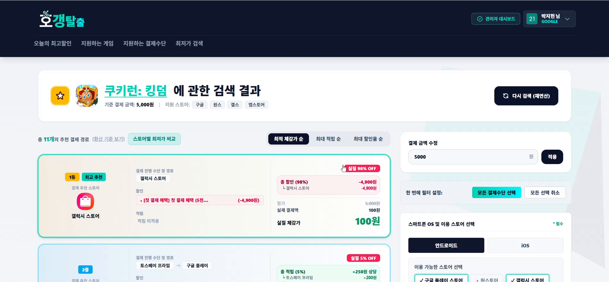
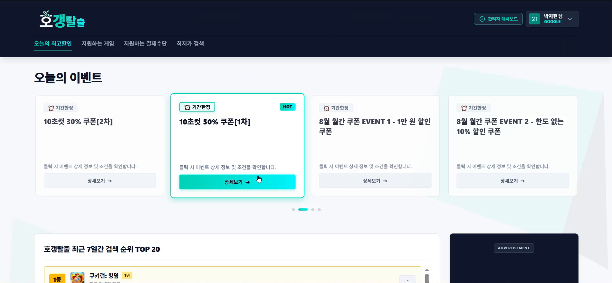
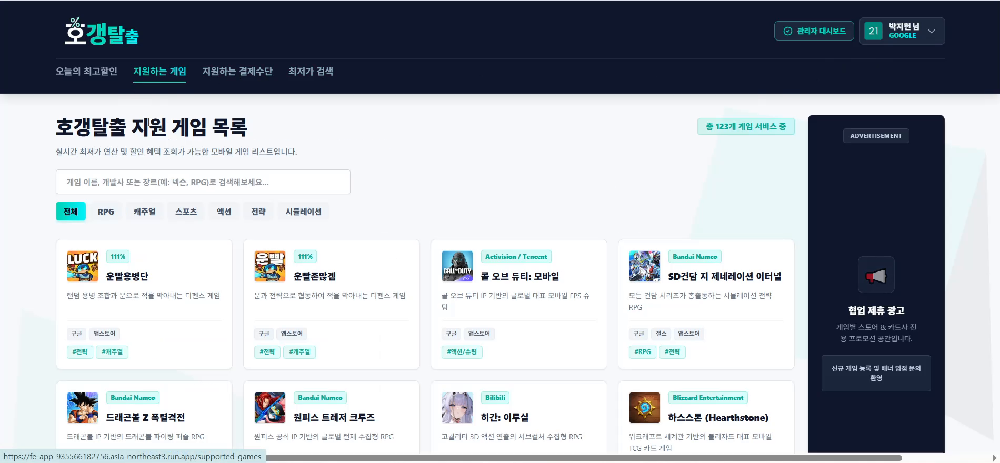
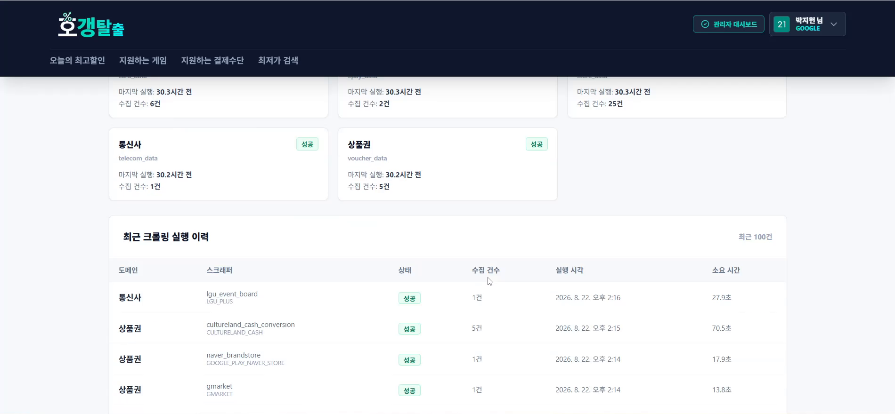
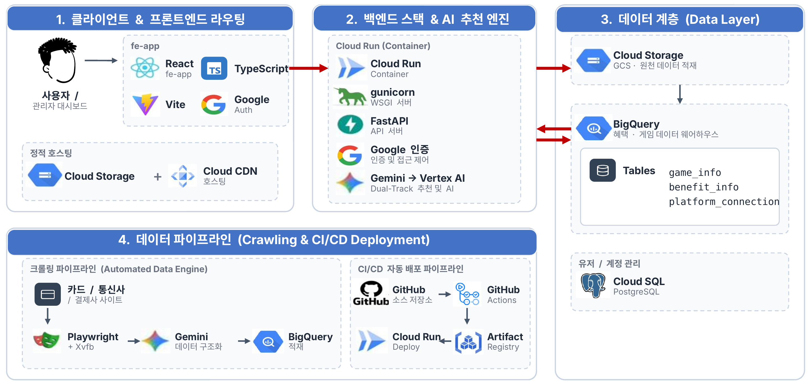

# 호갱 탈출 — 모바일 게임 최저가 결제 네비게이션

게임과 결제 금액, 내가 가진 카드·간편결제·통신사를 고르면 **가장 적게 내는 결제 경로**를 계산해 준다. 혜택은 카드사·스토어·간편결제·상품권·통신사 사이트 27곳을 크롤링해 모은다.



| | |
|---|---|
| 기간 · 인원 | 2026.07 ~ 08 · 4명, 부트캠프 팀 프로젝트 |
| 내 역할 | **데이터 파이프라인 · GCP 인프라** — 크롤링 자동화, BigQuery 적재, 배포 |
| 스택 | React · FastAPI · BigQuery · Cloud SQL · Cloud Run · Playwright · Gemini |
| 배포 | 지금은 내려가 있다. 부트캠프 GCP 프로젝트가 교육 종료와 함께 삭제됐다. 아래 화면으로 대신한다 |

## 시연


https://github.com/user-attachments/assets/89397d82-d3a6-4468-987d-2038ffc9c4b9


## 화면

| | |
|---|---|
|  |  |
| **최저가 검색.** 게임과 금액, 가진 통신사·간편결제·상품권·카드를 고른다. 설정은 저장해 두고 다시 쓴다. | **오늘의 최고할인.** 지금 열려 있는 이벤트와 최근 7일 검색 순위. |
|  |  |
| **지원 게임 123개.** 장르·스토어별로 찾는다. | **관리자 대시보드.** 크롤러가 어제 다 돌았는지, 몇 건을 모았는지 스크래퍼 단위로 본다. |

## 구조



크롤링 파이프라인을 펼치면 이렇다.

```text
Cloud Scheduler ─┬─ Cloud Run Job  (크롤러 21개)  ─┐
                 └─ GCE VM, headed (크롤러 6개)   ─┴─▶ GCS ─▶ Cloud Function ─▶ BigQuery
                                                                                  │
                                    React ◀── FastAPI (Cloud Run) ◀───────────────┘
                                                 └── Cloud SQL (회원 · 로그)
```

크롤러는 페이지 본문만 긁고, 구조화는 Gemini 가 공통 스키마에 맞춰 한다. 그래서 27개 사이트의 HTML 이 바뀌어도 선택자를 따라 고칠 일이 적다.

## 결정과 근거

**1. 크롤러 6개만 VM 으로 떼어 냈고, 하나는 포기했다.**
Cloud Run 에서 일부 사이트가 에러 없이 0건을 냈다. 로그를 보니 headless 브라우저를 탐지한 차단 페이지였다. 전부 VM 으로 옮기면 늘 켜 둔 VM 값이 나가서, 막히는 6개만 Xvfb + headed 크롬 VM 으로 옮겼다([`vm_crawl_entrypoint.py`](vm_crawl_entrypoint.py)). 삼성페이는 VM 에서도 막혀 자동 수집을 포기하고 수동 데이터로 표시해 뒀다. 자동화가 안 되는 구간을 자동화된 척 두지 않으려고.

**2. 깨진 CSV 는 넣지 않고 격리한다.**
혜택은 금액 계산에 바로 쓰여서, 일부만 깨진 데이터가 들어가는 쪽이 적재 실패보다 위험하다. 실패한 파일은 `quarantine/` 으로 옮기고 사유를 남긴다([`bigquery/main.py`](bigquery/main.py#L86)). 이 실패 경로를 일부러 테스트하다가, 컬럼이 아예 없는 CSV 는 `KeyError` 로 격리도 못 하고 함수가 죽는 버그를 찾았다.

**3. enum 값을 옮기기 전에 계산 엔진부터 읽었다.**
다른 브랜치의 통신사 혜택은 `STORE_COUPON` 으로 표시돼 있었다. 그런데 계산 엔진은 `STORE_COUPON` 이면 결제수단 보유 여부를 검사하지 않는다([`calculator.py`](game-pay-api/engine/calculator.py#L326-L341)). 그대로 옮겼다면 통신사 가입자가 아닌 사람에게도 할인을 추천했다. `PAYMENT_PG` 로 바꿨다.

**4. 테이블을 통째로 바꾸지 않고, 출처 단위로 지우고 넣는다.**
`benefit_info` 에는 팀원이 직접 넣은 행도 섞여 있었다. 통째로 교체하면 그게 사라진다. 이번 CSV 의 `source_file` 행만 지우고 다시 넣게 했고([`load_to_bigquery.py`](bigquery/scripts/load_to_bigquery.py#L56)), 덕분에 크롤러 하나만 다시 돌려도 그 출처만 갱신된다.

**5. 배포 키를 레포에 두지 않았다.**
GitHub Actions → Cloud Run 배포는 서비스 계정 키 대신 Workload Identity Federation 으로 인증한다([`deploy-backend.yml`](.github/workflows/deploy-backend.yml)). 유출될 키 자체가 없다. DB 비밀번호와 API 키는 Secret Manager 에서 주입한다.

<details>
<summary>그 밖의 결정 7개</summary>

| 결정 | 이유 |
|---|---|
| Cloud Function 을 폴더 전체로 배포 | `scripts/` 만 올렸더니 스키마 파일이 빠져 CSV 가 전부 격리됐다 |
| `incoming/` 필터링을 함수 안에서 | Eventarc GCS 트리거는 경로 접두사로 거를 수 없다 |
| `benefit_id` 해시에서 종료일 제외 | 이벤트 기간이 연장될 때마다 새 혜택으로 중복 생성되지 않게 ([`normalize.py`](card_data/common/normalize.py#L32-L42)) |
| 크롤링 로그를 스크래퍼마다 즉시 적재, `run_id` 는 KST 날짜 | 브라우저가 중간에 죽어도 기록이 남고, 오케스트레이터 없이 같은 날 실행분이 묶인다 ([`crawl_log.py`](card_data/common/crawl_log.py)) |
| BigQuery(혜택) / PostgreSQL(회원·로그) 분리, 혜택은 10분 캐시 | 분석용 대량 조회와 건당 트랜잭션은 요구가 다르다 |
| DB 연결에 실패해도 서버는 먼저 뜨게 | Cloud SQL 이 늦으면 컨테이너가 죽어 배포 자체가 실패했다 |
| `genai.Client` 전역 싱글턴 | 호출마다 새로 만들면 커넥션이 일찍 닫히는 SDK 버그([#1763](https://github.com/googleapis/python-genai/issues/1763)) |

</details>

## 한계와 개선 방향

- 인프라를 코드로 남기지 않았다. Cloud Run Job · Scheduler · VM · Cloud Function 을 진단하며 `gcloud` 로 직접 구성했고, 부트캠프 종료로 프로젝트가 회수되자 구성도 함께 사라졌다. 코드보다 인프라 재현이 더 어렵다는 걸 이때 배웠고, 다시 한다면 Terraform 같은 IaC 로 처음부터 정의한다.
- 혜택 조건 원문을 키워드로 해석해서, 사이트가 표현을 바꾸면 조건을 놓칠 수 있다. 이런 사례를 회귀 테스트로 고정해 두는 것이 필요하다는 것을 배웠다.

<details>
<summary>실행하기</summary>

**크롤러** — `.env` 에 `GEMINI_API_KEY`, 인증은 `gcloud auth application-default login`

```bash
pip install -r card_data/requirements.txt && playwright install chromium
python -m card_data.run_all        # store_data · epay_data · voucher_data · telecom_data 도 같은 방식
xvfb-run -a python vm_crawl_entrypoint.py   # headless 로 막히는 6개 (리눅스)
```

**API · 프론트** — 루트 `.env` 에 `DB_HOST` `DB_PORT` `DB_NAME` `DB_USER` `DB_PASSWORD` `GOOGLE_CLIENT_ID`

```bash
cd game-pay-api && pip install -r requirements.txt
python migrate_admin_dashboard.py           # 최초 1회
uvicorn main:app --reload --port 8000

cd fe-app && npm ci && npm run dev          # http://localhost:5173
```

**관리자 권한** — 승격 API 는 일부러 두지 않았다. 구글 로그인 후 직접 바꾸고 다시 로그인한다.

```bash
python -c "
from database import SessionLocal; from models import UserModel
db = SessionLocal(); u = db.query(UserModel).filter(UserModel.email=='me@gmail.com').first()
u.role = 'ROLE_ADMIN'; db.commit()"
```

</details>

## 만든 사람

| | |
|---|---|
| [@LakkeTree](https://github.com/LakkeTree) — 박지헌 | 데이터 파이프라인 · GCP 인프라. 크롤러 통합, GCS → BigQuery 자동 적재, 크롤링 자동화(Cloud Run Job · VM), CI/CD. 위 「결정과 근거」 1~5 |
| [@Hoon123450](https://github.com/Hoon123450) | 프론트엔드 화면 전반, 계산 엔진 |
| Kyungtae Lee | 초기 혜택 크롤링 파이프라인과 스키마 설계, 관리자 대시보드 |
| [@choi10-hub](https://github.com/choi10-hub) | 백엔드 API · 구글 로그인, Cloud Run 배포, 캐싱 |
